# 🌐 Cisco Packet Tracer - Static Routing Topology  

Repository ini berisi simulasi jaringan menggunakan **Cisco Packet Tracer**, dengan topologi sederhana **2 Router, 2 Switch dan 4 PC**.  
Tujuan utama adalah **mengenal static routing**, yaitu dua jaringan berbeda yang bisa saling terhubung melalui router.  

---

## 🖼️ Topologi Jaringan  

- **PC1 dan PC2** terhubung ke Switch1  
- **PC3 dan PC4** terhubung ke Switch2  
- **Switch1** terhubung ke Router1
- **Switch2** terhubung ke Router2
- **Router1** terhubung ke Router2  

📌 Gambaran topologi:  
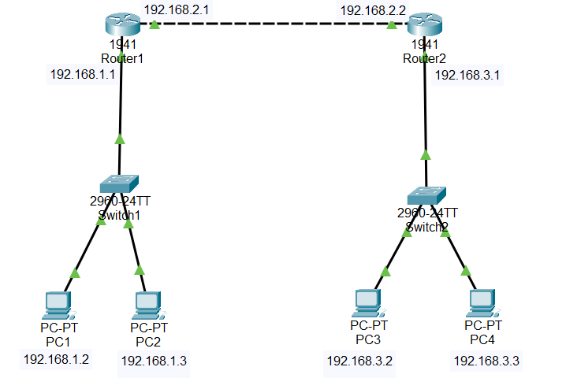  

---

## 📑 Spesifikasi Perangkat  

- **Router**: Cisco 1941 (2 unit)  
- **PC**: PC-PT (4 unit)  
- **Switch**: 2960 (2 unit)
- **Kabel yang digunakan**:  
  - Copper Straight-Through → **PC ↔ Switch ↔ Router**  
  - Copper Cross-Over → **Router ↔ Router** (FastEthernet/GigabitEthernet)  
  - *(Opsional)* Serial → jika ingin belajar dengan modul WIC-2T  

---

## 🔧 Konfigurasi IP Address  

### 💻 PC1  
- IP Address: `192.168.1.2`  
- Subnet Mask: `255.255.255.0`  
- Default Gateway: `192.168.1.1`  

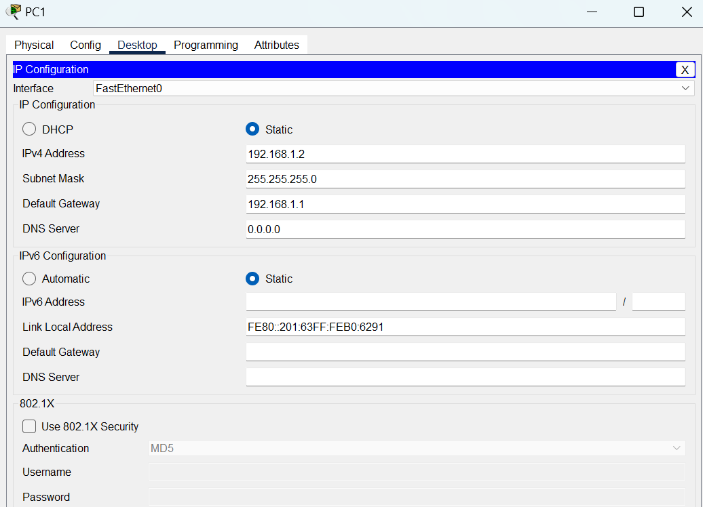  

### 💻 PC2  
- IP Address: `192.168.1.3`  
- Subnet Mask: `255.255.255.0`  
- Default Gateway: `192.168.1.1`  

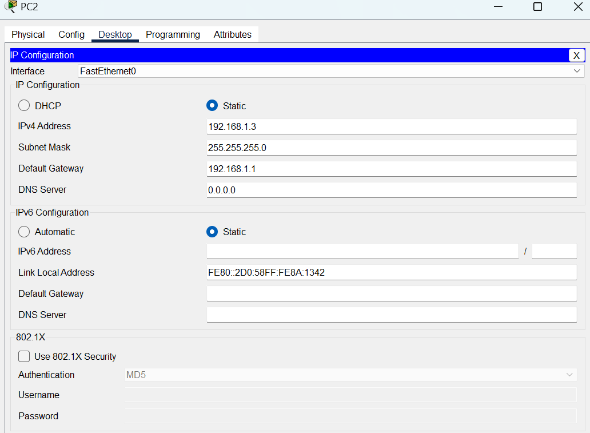  

### 💻 PC3  
- IP Address: `192.168.3.2`  
- Subnet Mask: `255.255.255.0`  
- Default Gateway: `192.168.3.1`  

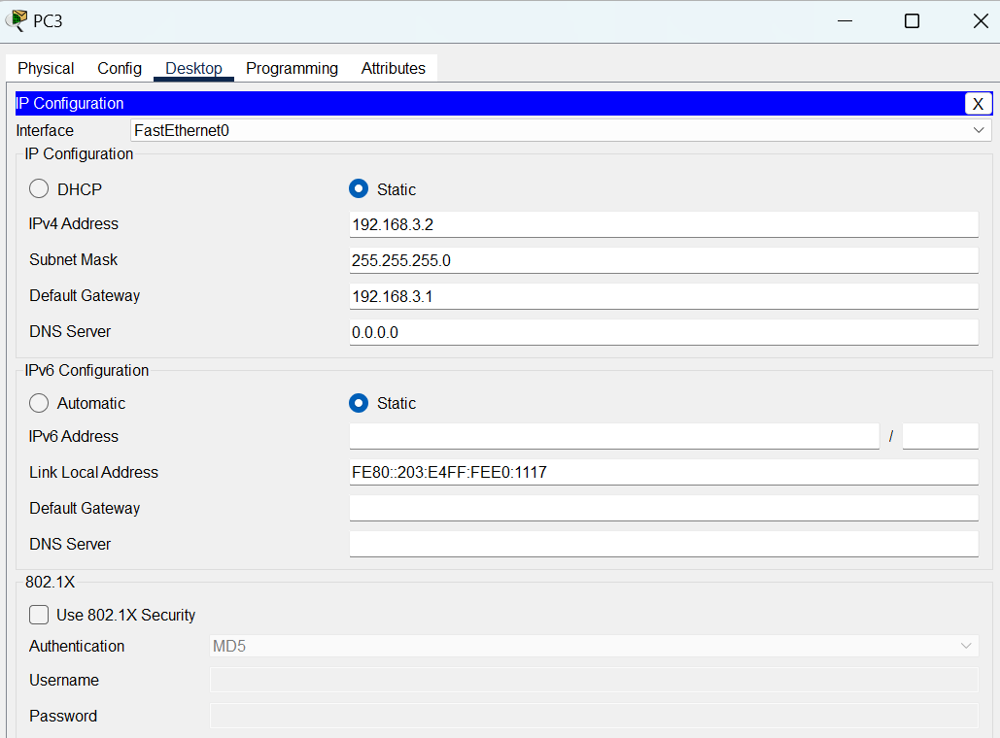  

### 💻 PC4  
- IP Address: `192.168.3.3`  
- Subnet Mask: `255.255.255.0`  
- Default Gateway: `192.168.3.1`  

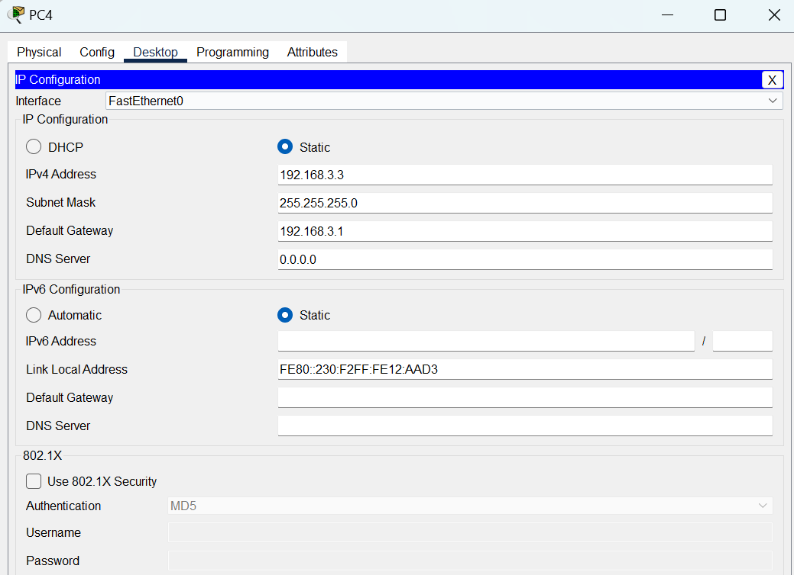  

---

## ⚙️ Konfigurasi Router  

### 📡 Router 1
- Router1 terhubung ke Switch1 GigabitEthernet0/0

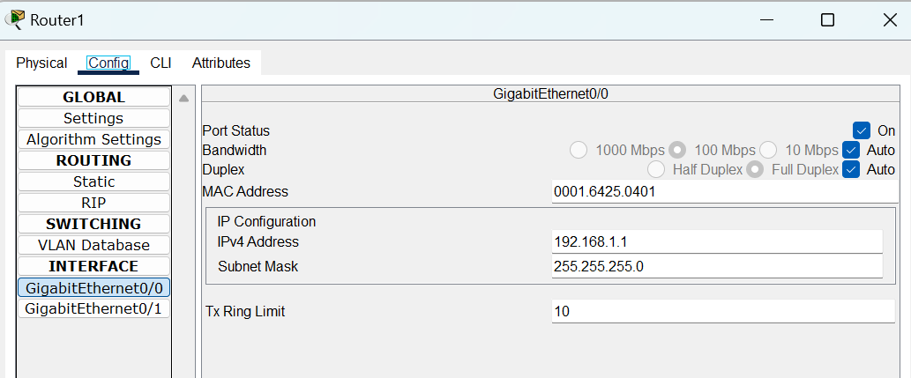

- Router1 terhubung ke Router2 GigabitEthernet0/1

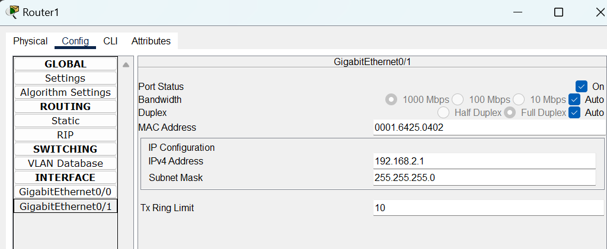

- Router1 Static Routing 

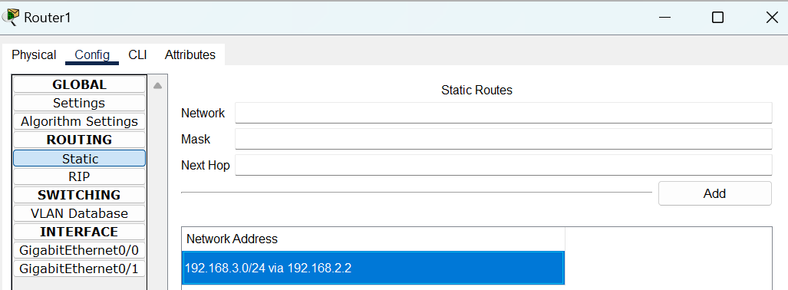

### 📡 Router 12
- Router1 terhubung ke Switch1 GigabitEthernet0/0

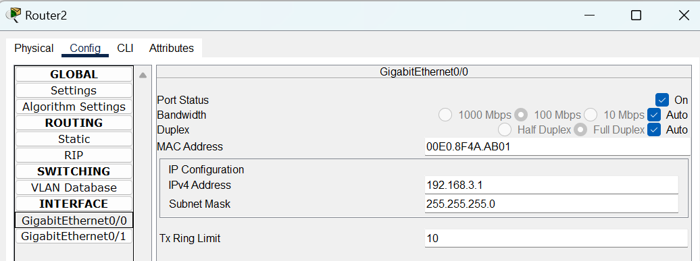

- Router1 terhubung ke Router2 GigabitEthernet0/1

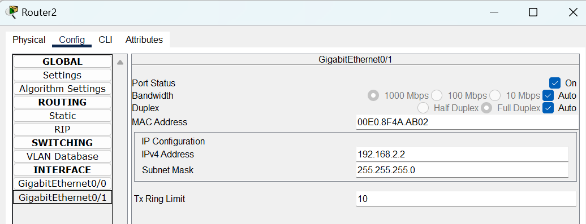

- Router2 Static Routing 

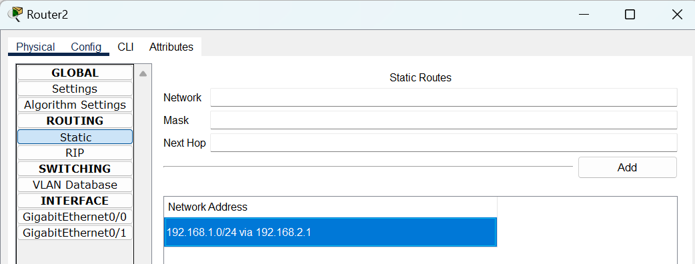

## 🔧 Pengujian Koneksi Antar Perangkat
Setelah semua perangkat di konfigurasi, lakukan pengujian dengan ping antar perangkat  

### 📡 PC1 ↔ PC2
Pengujian dalam jaringan router yang sama yaitu router1

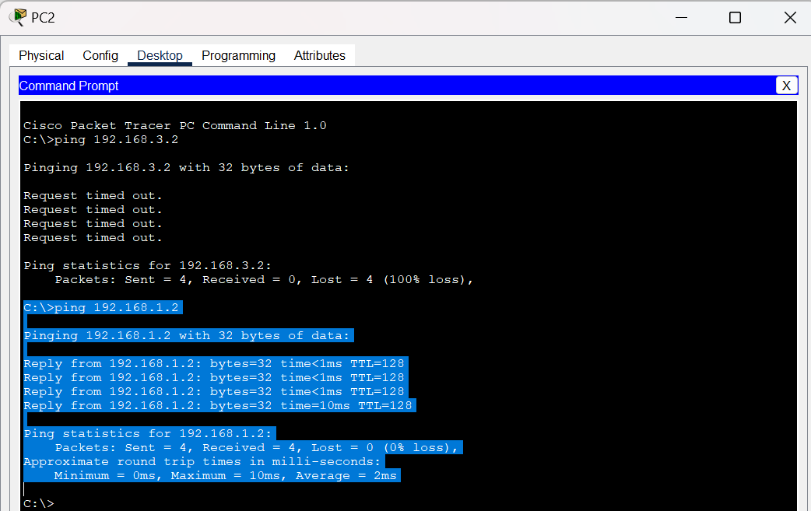

### 📡 PC2 ↔ PC4
Pengujian dengan melewati 2 router yang berbeda yaitu router1 dan raouter2 

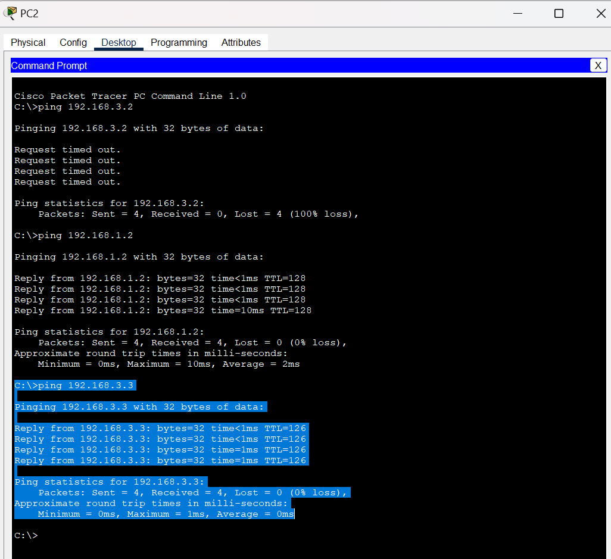

## 📡 Tampilan Topologi jaringan
Berikut adalah hasil topologi jaringan yang di buat menggunakan **Cisco Packet Tracer** 

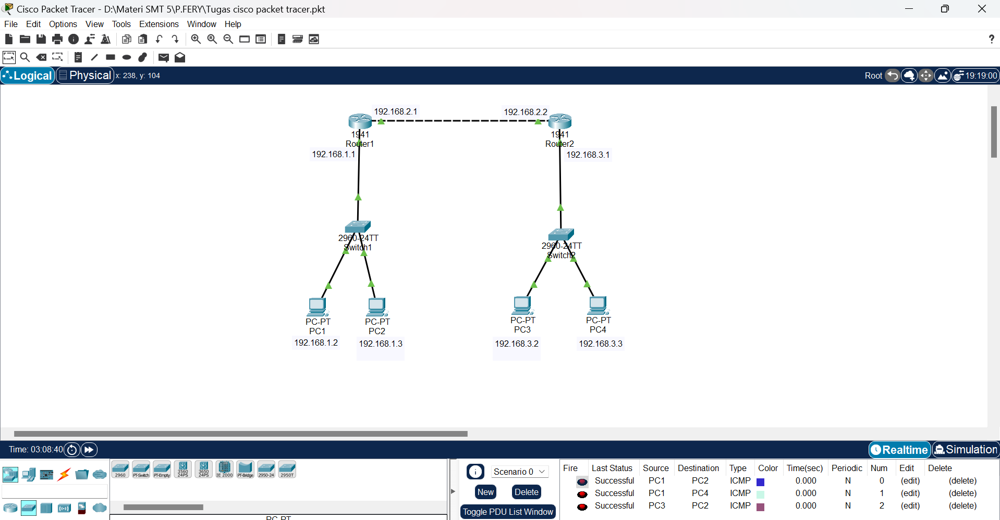

## Kesimpulan

- Topologi jaringan ini berhasil menghubungkan dua subnet berbeda (192.168.1.0/24 dan 192.168.3.0/24) menggunakan dua router sebagai perantara.

- Konfigurasi IP Address pada PC, Router interface, dan Default Gateway sudah sesuai, sehingga setiap perangkat dapat dikenali dalam jaringan.

- Penerapan static routing pada masing-masing router memastikan jalur komunikasi antar subnet dapat ditentukan secara manual dan stabil.

- Pengujian dengan perintah ping dari PC1 ke PC2 (dan sebaliknya) menunjukkan konektivitas berjalan lancar dengan adanya Reply dari host tujuan.

- Dengan topologi ini, dapat dipahami konsep dasar routing bahwa sebuah router dapat menjadi penghubung utama antar jaringan yang berbeda.

# 🌐 Cisco Packet Tracer - Static Routing Topology

<!-- Created by Laksono Sheptian Y.P -->

