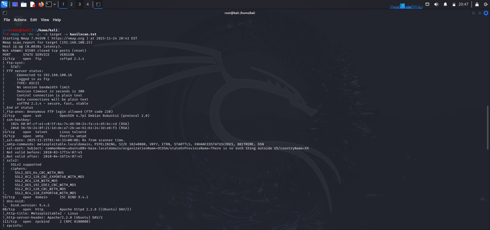
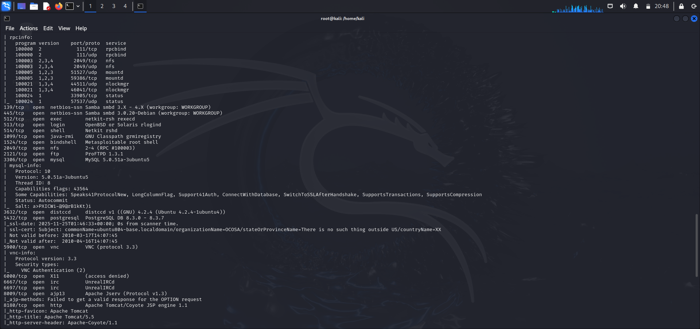
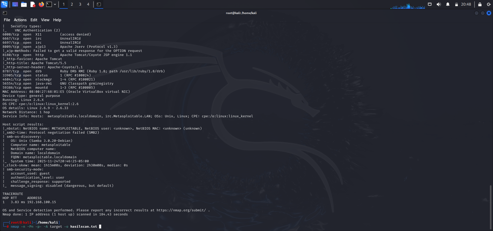

# 🔍 Laporan Hasil Scan Nmap – Metasploitable2

Repository ini berisi dokumentasi hasil scanning Nmap pada host **192.168.100.15** (Metasploitable2).

---

# 🖼️ Screenshot Hasil Scan

## 📌 Screenshot 1

## 📌 Screenshot 2

## 📌 Screenshot 3

---

# 📌 Command Nmap

### Penjelasan Parameter:
- **-n** : Tidak melakukan resolusi DNS  
- **-Pn** : Menganggap host hidup (skip host discovery)  
- **-p-** : Memindai semua 65535 port TCP  
- **-A** : OS detection, service version, script scanning, traceroute  
- **target** : IP 192.168.100.15 

---

# 📊 Tabel Hasil Scan Port

| Port | Status | Deskripsi |
|------|--------|-----------|
| 21 | open | FTP – vsftpd 2.3.4 • ftp-anon: Anonymous login allowed (FTP code 230). Server rentan terhadap vsftpd 2.3.4 Backdoor. |
| 22 | open | SSH – OpenSSH 4.7p1 Debian 8ubuntu1 (protocol 2.0) • Versi lama dan rentan terhadap exploit autentikasi. |
| 23 | open | Telnet – Linux telnetd • Tidak terenkripsi; rentan terhadap sniffing kredensial. |
| 25 | open | SMTP – Postfix smtpd • VRFY & ETRN aktif. Cert CN: ubuntu804-base.localdomain. |
| 53 | open | DNS – ISC Bind 9.4.2 • Rentan cache poisoning. |
| 80 | open | HTTP – Apache httpd 2.2.8 (Ubuntu) DAV/2 • Title: Metasploitable2 - Linux. Versi lama dan rentan RCE. |
| 111 | open | rpcbind – RPC #100000 • Sering dieksploitasi untuk serangan RServices/NFS. |
| 139 | open | SMB – Samba 3.0.20-Debian (WORKGROUP) |
| 445 | open | SMB – Samba 3.0.20-Debian • SMB signing disabled. Rentan MiTM & RCE. |
| 512 | open | exec – BSD rexecd • RServices tanpa enkripsi. |
| 513 | open | login – rlogind • Autentikasi berbasis host lemah. |
| 514 | open | shell – netkit-rsh remsh • RServices tanpa enkripsi. |
| 1099 | open | Java RMI – GNU Classpath girmiregistry • Rentan RCE. |
| 2049 | open | NFS – rpc.nfsd • Dapat dimount tanpa autentikasi. |
| 2121 | open | FTP – ProFTPD 1.3.1 • Versi rentan RCE. |
| 3306 | open | MySQL 5.0.51a-3ubuntu5 • root tanpa password (default credential). |
| 3632 | open | distccd v1 (GNU) • Rentan RCE; berjalan tanpa autentikasi. |
| 5432 | open | PostgreSQL 8.3.x • Rentan brute-force & privilege escalation. |
| 5900 | open | VNC – protocol 3.3 • Tidak terenkripsi; rentan brute-force. |
| 6000 | open | X11 (access denied) • Dapat digunakan untuk screenspy/keylogging. |
| 6667 | open | UnrealIRCd • Memiliki backdoor RCE bawaan. Sangat kritis. |
| 8009 | open | Apache Tomcat AJP13 • Rentan Ghostcat (file inclusion + RCE). |
| 8180 | open | HTTP – Apache Tomcat/Coyote JSP Engine 1.1 • Rentan weak admin password dan upload webshell. |
| 8787 | open | dts – Ruby DBS 0/2 (Ruby 1.8) |
| 39049 | open | nlockmgr |
| 40294 | open | java-rmi |
| 43452 | open | java-rmi |
| 56490 | open | mountd |
| 58748 | open | mountd |

---

# 📘 Penjelasan Lengkap Hasil Scan Nmap

Berikut penjelasan layanan dari yang **paling kritis** hingga **umum diserang**.

---

## 🔥 **Layanan Sangat Kritis (Backdoor / Login Anonim)**

### **Port 21 – FTP (vsftpd 2.3.4)**
- Mengizinkan **anonymous login**  
- Memiliki **backdoor RCE populer** → akses shell remote

### **Port 6667 – UnrealIRCd**
- Versi ini memiliki **backdoor bawaan**
- Penyerang dapat langsung melakukan **Remote Code Execution**

### **Port 3306 – MySQL**
- username: **root**, password: **kosong**
- Memberikan full-access database  
- Risiko: pencurian data, penghapusan tabel, RCE via UDF

---

## ⚠️ **Layanan Tidak Terenkripsi / Rentan Sniffing**

### **Port 23 (Telnet), 512/513/514 (RServices)**
- Semua berjalan tanpa enkripsi  
- Mudah dipalsukan (host-based authentication)  
- Dapat menghasilkan akses root

### **Port 5900 – VNC**
- Tidak terenkripsi  
- Rentan brute-force  

---

## 📡 **Layanan Web Rentan RCE**

### **Port 80 – Apache 2.2.8**
- Versi sangat tua  
- Rentan RCE dan Directory Traversal

### **Port 8009 / 8180 – Apache Tomcat**
- 8009 → rentan Ghostcat (RCE)  
- 8180 → biasanya memiliki password default (admin:admin)

### **Port 3632 – distccd**
- Sangat mudah dieksploitasi  
- Memberikan **full shell access**

---

## 📂 **Layanan File Rentan**

### **Port 139/445 – SMB (Samba 3.0.20)**
- SMB signing disabled  
- Rentan RCE  
- Common exploit: **CVE-2007-2447**

### **Port 2049 – NFS**
- Dapat dimount tanpa autentikasi  
- Penyerang bisa baca/tulis file sensitif

---

# 📌 Ringkasan Tingkat Kerentanan

Host **Metasploitable2** sangat rentan karena:

- Banyak layanan versi lama  
- Banyak port kritis terbuka  
- Password default & anonymous login  
- Ada layanan dengan **backdoor bawaan**

---

# ✍️ Dibuat oleh:
**Laksono.s.y.p**

