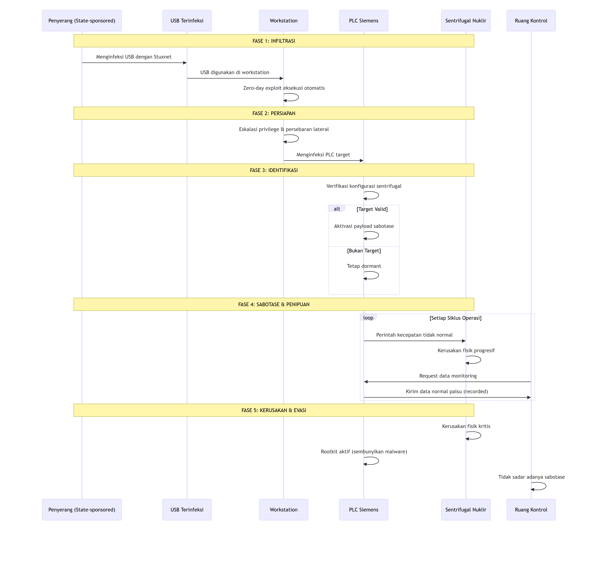

# ANALISIS CYBER WARFARE

## **BAGIAN A: SOAL LATIHAN PILIHAN GANDA & ESAI SINGKAT**

### **I. SOAL PILIHAN GANDA**

**1. Menurut definisi yang disajikan dalam materi, elemen paling fundamental yang membedakan Cyber Warfare dari bentuk serangan siber lainnya adalah...**

Jawaban: b. Aktornya adalah negara-bangsa (atau proksi-nya)

**2. Pengakuan Cyberspace sebagai domain peperangan kelima berarti bahwa...**

Jawaban: c. Aktivitas di ruang siber dapat dianggap setara dengan aksi militer di domain fisik.


**3. Serangan yang menargetkan persepsi manusia, seperti kampanye disinformasi dan operasi psikologis (PSYOP), terjadi pada lapisan Cyberspace yang mana?**
```
Jawaban: c. Cognitive Layer
```

**4. Peristiwa historis yang dianggap sebagai "titik balik" di mana serangan siber pertama kali berhasil melumpuhkan infrastruktur digital sebuah negara secara masif adalah...**
```
Jawaban: c. Serangan Siber terhadap Estonia (2007)
```

**5. Tindakan proaktif yang diambil di luar jaringan sendiri untuk memproyeksikan kekuatan dan mencapai tujuan militer, seperti melakukan spionase atau melancarkan serangan, diklasifikasikan sebagai...**
```
Jawaban: b. Operasi Siber Ofensif (OCO)
```

### **II. JAWABAN ESAI SINGKAT**

**6. Jelaskan dua karakteristik unik dari Cyberspace sebagai domain peperangan dan mengapa karakteristik tersebut mengubah sifat konflik modern!**
```
Jawaban: Dua karakteristik unik cyberspace adalah batas geografis yang kabur (serangan dapat dilancarkan dari mana saja ke mana saja) dan tingkat anonimitas yang tinggi. Hal ini mengubah sifat konflik karena membuat identifikasi pelaku menjadi sulit, mempercepat eskalasi, dan mengaburkan garis antara keadaan damai dan perang.
```

**7. Apa perbedaan fundamental antara motivasi di balik Cyber Warfare dan Cyber Crime? Berikan satu contoh untuk masing-masing.**
```
Jawaban: Perbedaan fundamentalnya terletak pada motivasinya: Cyber Warfare dimotivasi oleh tujuan geopolitik atau militer suatu negara, sedangkan Cyber Crime dimotivasi oleh keuntungan finansial atau pribadi.

Contoh:
• Cyber Warfare: Serangan Stuxnet untuk mengganggu program nuklir Iran.
• Cyber Crime: Ransomware WannaCry yang meminta tebusan uang.
```

**8. Mengapa insiden Morris Worm pada tahun 1988 dianggap sebagai peristiwa penting dalam sejarah keamanan siber, meskipun tidak dirancang untuk tujuan jahat?**
```
Jawaban: Morris Worm dianggap penting karena demonstrasi pertama bagaimana sebuah program dapat menyebar dengan cepat dan melumpuhkan sebagian besar internet awal, yang membuktikan kerentanan fundamental dalam jaringan terhubung dan memicu lahirnya bidang keamanan siber yang terorganisir.
```

**9. Dalam konteks Operasi Siber Militer, apa yang dimaksud dengan Mission Assurance dan mengapa hal ini menjadi tujuan utama dari Operasi Siber Defensif (DCO)?**
```
Jawaban: Mission Assurance adalah upaya untuk memastikan bahwa misi atau operasi kritis dapat terus berjalan meskipun terjadi serangan atau gangguan siber. Ini menjadi tujuan utama DCO karena fokusnya bergeser dari sekadar "melindungi jaringan" menjadi "menjamin kelangsungan fungsi operasional" yang vital.
```

**10. Jelaskan mengapa serangan Stuxnet dianggap sebagai momen "melintasi Rubicon" dalam sejarah cyber warfare!**
```
Jawaban: Stuxnet dianggap "melintasi Rubicon" karena ini adalah senjata siber pertama yang secara fisik merusak dan menghancurkan infrastruktur kritis di dunia nyata (pusat pemrosesan nuklir Iran), sehingga membuktikan bahwa serangan digital dapat memiliki konsekuensi fisik yang berbahaya seperti senjata konvensional.
```

---

## **BAGIAN B: TUGAS ANALISIS DAN STUDI KASUS**

### **TUGAS 1: ANALISIS KOMPARATIF – CYBER WARFARE vs. CYBER CRIME**

**Deskripsi Insiden:**
```
• Insiden ALFA: Sebuah kelompok meretas sistem perbankan nasional dan berhasil mencuri dana nasabah senilai miliaran rupiah. Jejak digital menunjukkan mereka menggunakan ransomware yang dibeli dari pasar gelap dan beroperasi dari Eropa Timur.

• Insiden BETA: Sebuah fasilitas pengolahan air milik negara tiba-tiba mengalami malfungsi pada sistem kontrol industrinya (PLC), menyebabkan tekanan air yang tidak stabil. Analisis forensik menemukan malware kustom yang sangat canggih dan tidak pernah terlihat sebelumnya, yang tampaknya hanya menargetkan tipe PLC spesifik tersebut. Tidak ada permintaan tebusan. Insiden ini terjadi di tengah meningkatnya ketegangan diplomatik dengan negara tetangga.
```

**1. Analisis Komparatif Berdasarkan Kriteria**

| **Kriteria** | **Insiden ALFA** | **Insiden BETA** |
|--------------|------------------|------------------|
| **Aktor** | Kelompok kriminal (kemungkinan dari Eropa Timur) | Negara bangsa (state-sponsored) dengan kemampuan tinggi |
| **Motivasi** | Keuntungan finansial (ekonomis) | Tujuan geopolitik/strategis |
| **Target** | Sistem perbankan (sektor finansial) | Infrastruktur kritis nasional (sistem pengolahan air) |
| **Metodologi** | Menggunakan ransomware komersial yang tersedia di pasar gelap | Malware kustom yang sangat canggih dan spesifik |
| **Tujuan Akhir** | Pencurian dana (kerugian ekonomi) | Gangguan operasional infrastruktur kritis (potensi destabilisasi) |

**2. Klasifikasi dan Justifikasi**

**Insiden ALFA → Cyber Crime**
```
Justifikasi:
• Motif ekonomi murni (pencurian dana)
• Menggunakan tools komersial yang tersedia umum
• Target sektor finansial untuk keuntungan pribadi
• Tidak ada indikasi tujuan politik atau militer
```

**Insiden BETA → Cyber Warfare**
```
Justifikasi:
• Target infrastruktur kritis nasional (strategis)
• Malware kustom yang sangat spesifik menunjukkan sumber daya negara
• Tidak ada permintaan tebusan - motif non-ekonomi
• Terjadi dalam konteks ketegangan diplomatik (motif geopolitik)
```

**3. Diagram Visualisasi Perbedaan Fundamental**

<p align="center">
  
</p>

**Kesimpulan Analisis:**
```
Insiden ALFA menunjukkan karakteristik kriminal siber klasik dengan motif ekonomi, sementara Insiden BETA mengindikasikan operasi perang siber state-sponsored yang bertujuan untuk mengganggu stabilitas nasional melalui target infrastruktur kritis. Perbedaan fundamental terletak pada aktor, motivasi, dan dampak strategis dari masing-masing insiden.
```

---

### **TUGAS 2: STUDI KASUS MENDALAM – ANATOMI SERANGAN STUXNET**

**1. Fase Utama Serangan Stuxnet:**

**Fase 1: Infiltrasi Awal & Menjembatani Air Gap**
```
• Stuxnet menyebar melalui removable drive (USB) yang terinfeksi
• Memanfaatkan zero-day vulnerability dalam Windows untuk eksekusi otomatis
• Menjembatani air gap dengan menginfeksi workstation yang tidak terhubung internet tetapi terhubung ke jaringan internal PLC
```

**Fase 2: Eskalasi Hak Akses & Persebaran Lateral**
```
• Mengeksploitasi zero-day vulnerability kedua untuk eskalasi privilege
• Menyebar melalui jaringan internal menggunakan kredensial yang dicuri
• Mencari sistem SCADA dan PLC target secara spesifik
```

**Fase 3: Identifikasi & Verifikasi Target**
```
• Memindai dan mengidentifikasi PLC Siemens S7-300/400 tertentu
• Memverifikasi bahwa PLC tersebut mengontrol sentrifugal nuklir IR-1
• Hanya mengaktifkan payload pada sistem yang memenuhi kriteria target
```

**Fase 4: Sabotase Fisik & Penipuan**
```
• Sabotase Fisik: Memodifikasi kode PLC untuk mengubah kecepatan sentrifugal (mempercepat dan memperlambat di luar batas aman)
• Penipuan/ Penyembunyian: Mengirim data normal palsu ke ruang kontrol untuk menyembunyikan kerusakan yang terjadi
```

**Fase 5: Pemeliharaan Akses & Evasi**
```
• Menginstal rootkit untuk menyembunyikan keberadaan malware
• Mempertahankan akses untuk potensi serangan lanjutan
• Membersihkan jejak untuk menghindari deteksi
```

**2. Mekanisme Kunci Efektivitas Stuxnet:**

**Mekanisme Sabotase Fisik:**
```
Stuxnet secara spesifik memanipulasi kecepatan sentrifugal dengan pola akselerasi dan deselerasi ekstrem yang menyebabkan keausan mekanis cepat dan kerusakan fisik permanen pada peralatan nuklir, sambil tetap beroperasi dalam parameter yang tampak normal.
```

**Mekanisme Penipuan/Penyembunyian:**
```
Malware ini mengimplementasikan man-in-the-middle attack terhadap sistem monitoring dengan merekam data operasi normal dan memutar ulang data tersebut ke operator, sehingga kerusakan fisik yang terjadi tidak terdeteksi hingga benar-benar parah.
```

**3. Diagram Alur Serangan Stuxnet:**

<p align="center">
  
</p>

**Poin Kritis Keberhasilan Stuxnet:**
```
1. Multi-stage infiltration yang efektif menembus isolasi fisik
2. Target specificity yang hanya mengaktifkan diri pada lingkungan tertentu
3. Dual mechanism yang menggabungkan sabotase fisik dengan penipuan monitoring
4. Persistence yang mempertahankan akses sambil menghindari deteksi
```

---

### **TUGAS 3: ANALISIS KONTEKSTUAL – DAMPAK CYBER WARFARE PADA PERTAHANAN MARITIM INDONESIA**

**1. Tiga Sistem/Aset Digital Paling Rentan dan Kritis:**

**a. AIS (Automatic Identification System)**
```
• Fungsi: Sistem pelacakan dan identifikasi kapal otomatis
• Kerentanan: Data tidak terenkripsi, mudah dimanipulasi
• Kritisitas: Tinggi - menjadi dasar awareness maritim
```

**b. ECDIS (Electronic Chart Display and Information System)**
```
• Fungsi: Sistem navigasi digital dan pemetaan elektronik
• Kerentanan: Kerentanan pada update charts dan integrasi GPS
• Kritisitas: Vital - navigasi keselamatan pelayaran
```

**c. Port Management System (Terminal Operating System)**
```
• Fungsi: Mengelola operasional pelabuhan, crane, dan logistik
• Kerentanan: Terhubung ke jaringan administrasi pelabuhan
• Kritisitas: Strategis - mempengaruhi rantai pasok nasional
```

**2. Skenario Serangan Siber Realistis:**

**Skenario 1: AIS Spoofing Attack**
```
• Vektor Serangan: Injeksi data AIS palsu melalui transmitter ilegal
• Konsekuensi: Kapal komersil dialihkan ke perairan berbahaya, tabrakan kapal, gangguan logistik nasional, kerugian ekonomi besar
```

**Skenario 2: ECDIS/GPS Spoofing**
```
• Vektor Serangan: Manipulasi sinyal GPS dan corrupt data chart ECDIS
• Konsekuensi: KRI dan kapal komersil tersesat, kandas di perairan dangkal, gangguan operasi patroli maritim, ancaman kedaulatan
```

**Skenario 3: Port System Ransomware**
```
• Vektor Serangan: Spear-phishing ke admin pelabuhan + ransomware pada TOS
• Konsekuensi: Pelabuhan utama lumpuh (Tanjung Priok, Surabaya), rantai pasok terputus, kerugian ekonomi $100-200 juta/hari
```

**3. Diagram Pemetaan Ancaman Siber Maritim:**

<p align="center">
  
</p>

**Analisis Dampak Strategis:**
```
Ancaman siber pada domain maritim Indonesia berpotensi menyebabkan:
1. Krisis kedaulatan melalui manipulasi awareness maritim
2. Kerugian ekonomi masif akibat gangguan rantai pasok
3. Krisis energi jika pelabuhan minyak lumpuh
4. Dampak geopolitik terhadap posisi Indonesia sebagai poros maritim dunia
```

**Rekomendasi:**
```
• Implementasi cybersecurity framework khusus sektor maritim
• Enkripsi dan autentikasi data AIS/ECDIS
• Air-gapping sistem kritis pelabuhan
• Latihan gabungan TNI AL-Badan Siber Nasional menghadapi serangan siber maritim
```

---

**Dibuat oleh: Sertu Ttu Laksono Sheptian Yoga P**