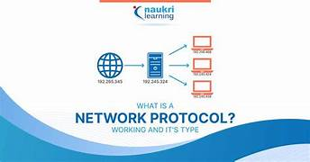
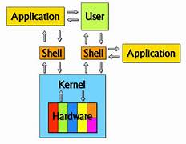
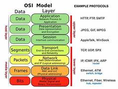
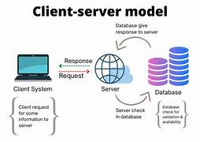
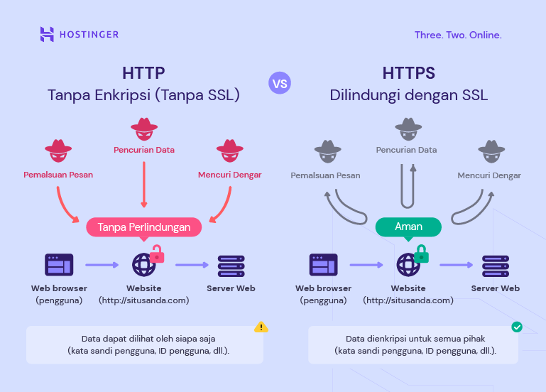
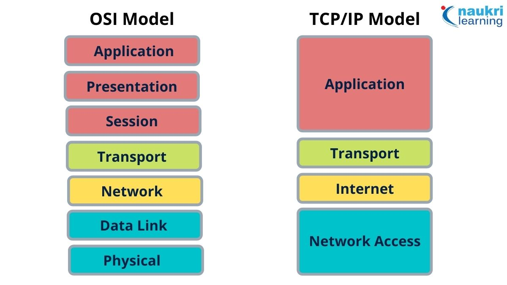

# Network Protocol

Repository ini berisai tentang **network protocol**, arsitektur komputer jaringan, OSI layer, TCP/IP (*peacetime*).

---

## 1) Network protocol
**Network protocol** adalah  seperangkat aturan dan standar yang memungkinkan perangkat-perangkat di jaringan—seperti komputer, server, dan perangkat lain—untuk saling berkomunikasi, bertukar data, dan bekerja sama dengan cara yang terstruktur dan dapat dipahami oleh semua pihak. Tanpa protocol, data bisa hilang, rusak, atau tidak sampai ke tujuan. Protocol juga menentukan bagaimana data dibagi menjadi paket, bagaimana paket dikirim, diperiksa, dan disusun kembali di sisi penerima, sehingga komunikasi di jaringan menjadi aman, efisien, dan handal.

    

---

## 2) Hardware, Kernel, OS, Apps, User, CPU, Process

- **Hardware**: Komponen fisik/perangkat keras komputer seperti CPU, RAM, harddisk, keyboard, dan layar.  
- **Kernel**: Bagian inti dari OS yang mengatur komunikasi antara hardware dan software.  
- **OS**: Sistem operasi, software yang mengelola hardware dan menyediakan lingkungan untuk aplikasi, misal Windows, Linux, macOS.  
- **Apps**: Program atau aplikasi yang digunakan pengguna, misal browser, game, atau pengolah kata.  
- **User**: Pengguna komputer yang berinteraksi dengan OS dan aplikasi.  
- **CPU (Central Processing Unit)**: Otak komputer, tempat semua perhitungan dan instruksi dijalankan.  
- **Process**: Program yang sedang berjalan di komputer, dikelola oleh OS agar CPU bisa mengeksekusi instruksi secara teratur.  

    

---

## 3) ISO-OSI (Open Systems Interconnection) Model 

**OSI** adalah standar konseptual yang membagi komunikasi jaringan menjadi 7 lapisan, supaya perangkat berbeda bisa saling berkomunikasi dengan terstruktur.

**7 Lapisan OSI dari atas ke bawah:**

- **Application Layer (Lapisan Aplikasi)** → Tempat aplikasi jaringan berinteraksi, misal browser, email, FTP.  
- **Presentation Layer (Lapisan Presentasi)** → Mengubah data agar bisa dimengerti, misal enkripsi, kompresi, format file.  
- **Session Layer (Lapisan Sesi)** → Mengatur komunikasi antara dua perangkat, termasuk membuka dan menutup sesi.  
- **Transport Layer (Lapisan Transport)** → Mengatur pengiriman data, memastikan sampai dengan benar (TCP/UDP).  
- **Network Layer (Lapisan Jaringan)** → Menentukan rute data sampai tujuan, misal IP.  
- **Data Link Layer (Lapisan Data Link)** → Mengatur pengiriman data dalam bentuk frame antar perangkat di jaringan lokal.  
- **Physical Layer (Lapisan Fisik)** → Media fisik untuk mengirim data, misal kabel, sinyal, radio.  

    

---

## 4) Alur komunikasi User–Client–Server dalam OSI Model

- **User** → memberi perintah lewat aplikasi.  
- **Client (App)** → mengirim request ke server melalui OSI Layers → Network.  
- **Server** → memproses dan mengirim response kembali ke client.  
- **Hasil** → akhirnya ditampilkan ke User.  

    

---

## 5) Alur kerja internet

- User membuka aplikasi (misalnya browser) dan mengetik alamat web, contoh: www.google.com.  
- Client (komputer/HP) mengirim permintaan (request) ke jaringan melalui protocol (HTTP/HTTPS).  
- DNS (Domain Name System) menerjemahkan nama domain www.google.com menjadi alamat IP (contoh: 142.250.190.78).  
- Routing: Permintaan dikirim melewati router, switch, dan perangkat jaringan lain menuju server tujuan.  
- Server menerima permintaan, memproses data (misalnya menyiapkan halaman web).  
- Server mengirim balasan (response) kembali melalui internet.  
- Client menerima data, data naik melalui lapisan OSI sampai ke aplikasi (browser).  
- User melihat hasil di layar (misalnya halaman Google terbuka).  

    

---

## Diagram OSI-TCP/IP

    

---

## Di Buat Oleh 
- Sertu Ttu Laksono Sheptian Yoga Pratama.
